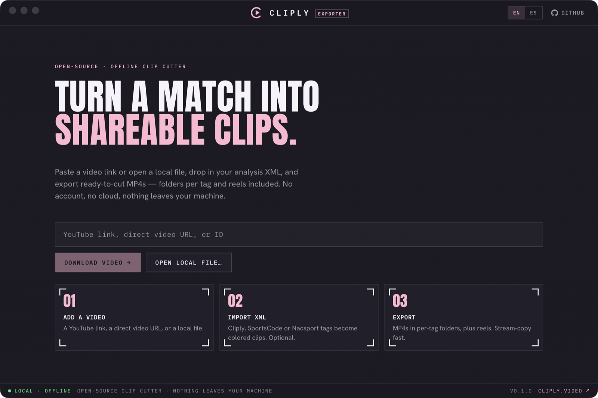

<p align="center">
  
</p>

<p align="center">
  Open-source desktop clip cutter — paste a link, import your analysis XML,
  review the clips, and export MP4s with ffmpeg.
</p>

<p align="center">
  <i>Fully offline and local — no account, no cloud, no telemetry.</i>
</p>

<p align="center">
  
</p>

> Want hosting, teams, sharing and live collaboration? Check out the full app at
> [cliply.video](https://cliply.video).

## Features

- **Flexible input** — a YouTube URL or video ID (downloaded locally with
  yt-dlp), a direct media URL, or a local video file. Live progress, cancelable.
- **Sports-analysis XML** — import Cliply / SportsCode / Nacsport
  `ALL_INSTANCES` XML; your tags become colored clips, read straight from the
  codes and colors in the file. BOM-aware (handles Windows UTF-16 exports).
- **Review &amp; pick** — clips grouped by tag with color dots and poster
  thumbnails, an in-app player to watch any clip, and per-clip / per-group /
  select-all selection.
- **Export your way** — one MP4 per clip in tidy per-tag folders, plus per-tag
  reels and a single combined reel. Stream-copy cut (fast) or re-encode
  (frame-accurate).
- **100% offline &amp; local** — everything runs on your machine, stored in a
  local SQLite DB. No sign-up, no upload, no telemetry.
- **English &amp; Español** — toggle the language any time in the title bar.

## Install

Grab a build from [Releases](https://github.com/cliply-video/cliply-exporter/releases):
macOS `.dmg`, Windows `.exe`, Linux `.AppImage` / `.deb`. Unsigned for now — on
macOS, right-click → **Open** the first time to get past Gatekeeper.

## Runtime dependencies

Two external tools, never bundled (keeps the app permissively licensed and the
download small):

- **yt-dlp** (Unlicense) — auto-downloaded on first run (pinned, SHA256-verified),
  all platforms.
- **ffmpeg / ffprobe** (LGPL) — auto-downloaded on macOS (evermeet static build).
  On Windows/Linux, install it yourself (package manager) or point at it.

Already have them on your `PATH` (e.g. Homebrew)? Those are used and the download
is skipped. Override explicitly with `FFMPEG_PATH`, `FFPROBE_PATH`, `YTDLP_PATH`.

## Status

| Phase | Scope | State |
| ----- | ----- | ----- |
| P1 | App skeleton + binary auto-download | ✅ |
| P2 | Download + XML import + clip list | ✅ |
| P3 | Export (clips + folder-per-tag + reels) | ✅ |
| P4 | Cross-platform packaging + CI | ✅ |

macOS signing/notarization is wired but off by default, so current builds are
unsigned (see [`docs/signing.md`](docs/signing.md)). Roadmap:
[`docs/plan.md`](docs/plan.md).

## Develop

Prereqs: Rust (stable), Node 20+.

```bash
npm install
npm run app        # tauri dev (Vite + Rust)
npm run app:build  # production bundle
```

CI (`.github/workflows/ci.yml`) runs typecheck + build and `cargo check`/`test`
on every push. Pushing a `vX.Y.Z` tag triggers `release.yml`, which builds
macOS (universal: arm64 + x64), Windows, and Linux, and opens a draft GitHub
release.

App icon: edit `src-tauri/icons/icon-source.svg`, then
`rsvg-convert -w 1024 -h 1024 src-tauri/icons/icon-source.svg -o /tmp/i.png &&
npx tauri icon /tmp/i.png -o src-tauri/icons`.

## License

[Apache-2.0](LICENSE). ffmpeg and yt-dlp are downloaded at runtime as separate
binaries and are not distributed with this app; see their respective licenses.
